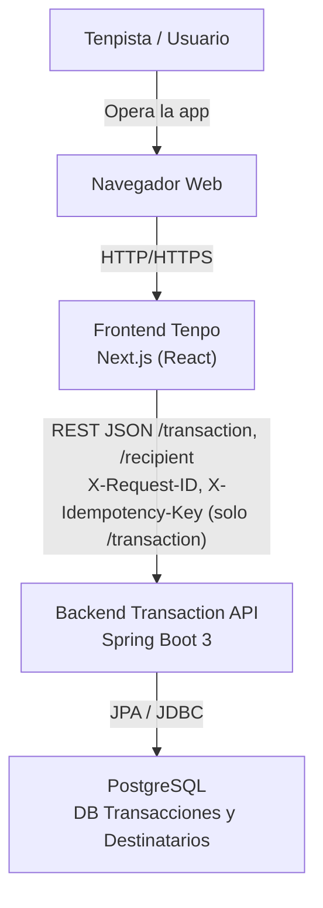
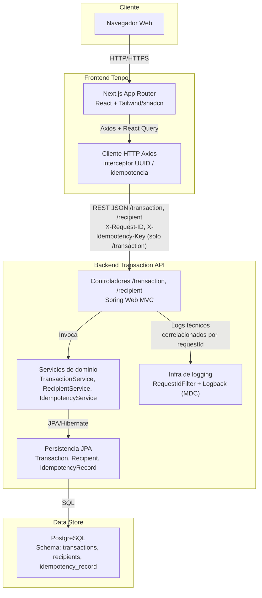

# Challenge Tenpo - Fullstack

Aplicación fullstack para gestión de transacciones Tenpista: frontend en Next.js (React) y backend en Spring Boot, orquestados con Docker Compose. El frontend está preparado para **idempotencia** (UUID por operación, headers `X-Request-ID` y `X-Idempotency-Key`) y el backend los consume para evitar duplicados y trazabilidad.

---

### Arquitectura (vista C4)

#### C4 – Diagrama de contexto (C1)



- **Tenpista**: usuario final que crea y consulta transacciones.
- **Frontend Tenpo**: aplicación web en Next.js que orquesta la experiencia de usuario.
- **Transaction API**: backend que valida, aplica idempotencia y persiste en la base de datos.
- **PostgreSQL**: almacén de datos relacional donde viven las transacciones y registros de idempotencia.

#### C4 – Diagrama de contenedores (C2)



Cuando levantas todo con Docker Compose hay tres contenedores principales:

- **Frontend (puerto 3000)**: la app web que abres en el navegador. Cuando creas o listas transacciones, llama por HTTP al backend.
- **Backend (puerto 8080)**: la API REST en Spring Boot. Recibe las peticiones del frontend, aplica validaciones, idempotencia y logging con UUID.
- **PostgreSQL (puerto 5432)**: la base de datos. El backend no arranca hasta que la base esté lista (healthcheck).

### Guía de inicio rápido

Requisitos: Docker y Docker Compose. El backend se construye desde el directorio hermano `challenge-backend` (misma carpeta padre que este repo) y el `docker-compose.yml` que orquesta **toda la solución (frontend + backend + DB)** vive dentro de `challenge-tenpo/`.

1. Estructura esperada de carpetas:
   ```text
   parent/
   ├── challenge-tenpo/      # Frontend + docker-compose fullstack
   └── challenge-backend/    # Backend Spring Boot (+ docker-compose propio opcional)
   ```

2. Definir variables de entorno (contraseña de la DB) dentro de `challenge-tenpo/`:
   ```bash
   cd challenge-tenpo
   cp .env.example .env
   # No es necesario pero puedes editar .env y asignar POSTGRES_PASSWORD (y opcionalmente POSTGRES_USER, POSTGRES_DB)
   ```

3. Levantar toda la pila (frontend + backend + PostgreSQL) desde `challenge-tenpo/`:
   ```bash
   cd challenge-tenpo
   docker-compose up --build
   ```

4. Abrir en el navegador:
   - **App**: [http://localhost:3000](http://localhost:3000)
   - **Swagger (API)**: [http://localhost:8080/swagger-ui.html](http://localhost:8080/swagger-ui.html)

### Endpoints

Con los servicios arriba, la API está disponible en **http://localhost:8080**:

| Método | Ruta           | Descripción |
|--------|----------------|-------------|
| GET    | /transaction   | Lista todas las transacciones |
| POST   | /transaction   | Crea una transacción. El frontend envía obligatoriamente `X-Idempotency-Key` (UUID) y `X-Request-ID`; body JSON: monto, giroComercio, nombreTenpista, fechaTransaccion. |
| GET    | /recipient     | Lista todos los destinatarios (destinatarios Tenpo) |
| POST   | /recipient     | Crea un destinatario. Body JSON: nombre, rut, numeroCuenta, email. El backend fija `tipoCuenta = "Tenpo"` y aplica validaciones. |

Documentación interactiva (OpenAPI/Swagger): [http://localhost:8080/swagger-ui.html](http://localhost:8080/swagger-ui.html).

### Idempotencia, destinatarios y headers (frontend)

- **UUID (V4):** Se genera con `crypto.randomUUID()` por cada intención de envío (un key por clic en "Crear transacción").
- **X-Idempotency-Key:** Se inyecta en cada POST de creación de transacción; en reintentos se reutiliza el mismo key (React Query y el hook pasan el mismo par `input` + `idempotencyKey`).
- **X-Request-ID:** El interceptor de Axios añade uno por request para correlación con los logs del backend.
- **User-Agent / X-App-Version:** Enviados en todas las peticiones (versión desde `NEXT_PUBLIC_APP_VERSION` o `0.1.0`).
- **UI (transacciones):** El botón "Crear transacción" se deshabilita de inmediato (`isSubmitting` + estado local `isBusy`) para evitar doble envío.
- **UI (destinatarios):** La vista de transacciones incluye una sección de destinatarios que permite crear y seleccionar destinatarios Tenpo (`RecipientSelector` + `RecipientForm`); el hook `useRecipients` consume `/recipient` y mantiene la lista sincronizada vía React Query.

### Decisiones técnicas

Se eligió **React (Next.js)** en el frontend y **Spring Boot** en el backend para una solución escalable y mantenible. Next.js ofrece SSR/SSG, enrutamiento integrado y un ecosistema estable para interfaces modernas; React permite componentes reutilizables y un estado predecible. Spring Boot aporta un stack backend estándar en la industria: inyección de dependencias, JPA para persistencia, validación declarativa y despliegue sencillo en contenedores. La separación frontend/backend permite escalar y desplegar cada parte de forma independiente y reutilizar la API desde web, móvil o otros clientes.

Para **integridad y trazabilidad** se añadió: generación de UUID en el cliente por operación; interceptor Axios que inyecta `X-Request-ID`, `X-Idempotency-Key` (en POST), `User-Agent` y `X-App-Version`; bloqueo del botón de envío; y en el backend idempotencia en PostgreSQL, logging con request ID en MDC y bloqueo optimista con `@Version`.

---

## Desarrollo local (sin Docker)

### Frontend (este proyecto)

- Node.js 18+
- `npm install` y luego `npm run dev`. App en [http://localhost:3000](http://localhost:3000).
- Configurar `NEXT_PUBLIC_API_BASE_URL` apuntando al backend (ej. `http://localhost:8081` si el backend corre en 8081).

### Backend

- Ver el README del proyecto [challenge-backend](../challenge-backend) para Java 21, Maven, PostgreSQL y `mvn spring-boot:run`. La API por defecto suele usar el puerto 8081 en local; en Docker Compose se expone en 8080.

---

## Tests

- **Frontend**: `npm run test` (Jest + React Testing Library). Incluye tests del formulario de transacciones y de la funcionalidad de destinatarios (`RecipientSelector`, hook `useRecipients`).
- **Backend**: desde la raíz de `challenge-backend`, `mvn test` (tests unitarios del servicio de transacciones y destinatarios, y tests de integración con H2 para controladores `/transaction` y `/recipient`).

---

## Estructura

- **Frontend**: Next.js App Router, React Query, react-hook-form + Zod, componentes en `app/` y `components/`. Cliente HTTP en `lib/api.ts` (Axios con interceptor para request ID, idempotency key y metadatos); hook `useTransactions` genera un UUID por creación y lo pasa a la API.
- **Backend**: Spring Boot 3, JPA, PostgreSQL; idempotencia vía tabla `idempotency_record`; controlador REST bajo `/transaction` (header `X-Idempotency-Key` obligatorio en POST); filtro de request ID y logging con MDC; bloqueo optimista en la entidad Transaction. Ver [challenge-backend/README.md](../challenge-backend/README.md) para esquema SQL y estructura.
